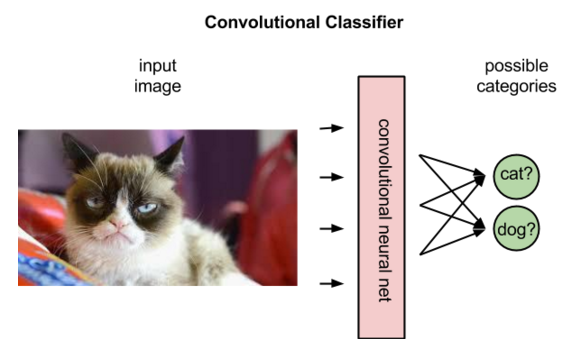

# 强化学习基础教程

神经网络由于近期在计算机视觉、机器翻译和时间序列预测等多个领域中取得的进展而声名远扬，但强化学习或许才是神经网络真正的“杀手级”应用。 

强化学习是目标导向的。强化学习算法可学习如何完成一项复杂的目标，从白纸一张的状态开始，经由许多个步骤来实现某一维度上的最大化。如果条件合适，此类算法的性能可以达到超人类的水平。 

目前，以深度学习为核心的强化学习算法在多款[Atari电子游戏](https://www.cs.toronto.edu/~vmnih/docs/dqn.pdf)中的表现已经能超越人类专家。虽然这样的成就看似不值一提，但实际上已是极大的进步。Deeplearning4j提供名为[RL4J](https://github.com/deeplearning4j/rl4j)的强化学习库，可实现两类强化学习算法－深度Q学习和A3C。它们[已能掌握《Doom》的玩法](https://www.youtube.com/watch?v=Pgktl6PWa-o)。

我们期待强化学习未来能在更为模糊的现实环境中取得更好的表现，同时可以在任意多个潜在动作中作出选择，而非只能掌握电子游戏中的有限选项。人们所谓的机器人大军就是这么建起来的。:) 

<a href="zh-quickstart" type="button" class="btn btn-lg btn-success" onClick="ga('send', 'event’, 'quickstart', 'click');">DEEPLEARNING4J快速入门指南</a>

## 强化学习

强化学习的基础概念包括主体、环境、状态、动作和奖励，下文将一一介绍。 

**主体**（agent）是动作的行使者，例如配送货物的无人机，或者电子游戏中奔跑跳跃的超级马里奥。 

**状态**（state）是主体的处境，亦即一个特定的时间和地点、一项明确主体与工具、障碍、敌人或奖品等其他重要事物的关系的配置。 

**动作**（action）的含义不难领会，但应当注意的是，主体需要在一系列潜在动作中进行选择。在电子游戏中，这一系列动作可包括向左或向右跑、不同高度的跳跃、蹲下和站着不动。在股票市场中，这一系列动作可包括购买、出售或持有一组证券及其衍生品中的任意一种。无人飞行器的动作选项则包括三维空间中的许多不同的速度和加速度。 

**奖励**（reward）是用于衡量主体的动作成功与否的反馈。例如，在电子游戏中，如果马里奥接触一枚金币，他就能赢得分数。主体向环境发出以动作为形式的输出，而环境则返回主体的新状态及奖励。

在上述反馈循环中，下标t和t+1表示时间步，区分不同的状态：第t个时刻的状态、第t+1个时刻的状态等。强化学习与有监督学习、无监督学习等其他形式的机器学习不同，我们只能将其视为一系列依次发生的状态－动作对的序列。 

强化学习根据动作产生的结果来评判动作。强化学习是目标导向的，这类算法最终要学会一套能帮助其实现目标的动作序列。在电子游戏中，目标是以最高得分完成游戏，所以在整个游戏过程中，得分每增加一分都会影响主体的后续行为；也就是说，主体可学会通过摧毁战舰、触碰金币或者躲避陨石来达到分数最大化。 

在现实世界中，学习目标可能是让机器人从A点移动至B点，而机器人每接近B点一英寸，就相当于获得了分数。 

强化学习解析输入的方式和有监督及无监督学习不同。具体的区别可以通过它们认识一样“东西”的方式来说明。 

无监督学习：这样东西像另外那样东西。（相似性，无名称）
有监督学习：这样东西是一个“双层培根芝士汉堡”。（标签）
强化学习把这样东西吃掉，因为它味道很好，而且可以让你继续活下去。（基于短期和长期奖励的动作。） 

<iframe width="420" height="315" src="https://www.youtube.com/embed/-uXVu0l8guo" frameborder="0" allowfullscreen></iframe>

我们可以把一个自主的强化学习主体想象成一位尝试用耳朵和手杖帮助自己行走的盲人。主体借以认知环境的窗口很小，而这些窗口甚至有可能不是认知其周遭环境的最合理方式。 

（事实上，决定主体应当关注*哪些类型*的反馈是一个很难解决的问题，但学习玩电子游戏的算法对此并未深究，因为电子游戏中的反馈类型有限且定义十分清晰。这些游戏和实验室中的无菌环境非常相似，用于对强化学习的构想进行初步测试。）

强化学习的目标是选择各种状态下的最佳已知动作，这意味着必须给动作赋予可供相互比较的值，然后排出高低次序。 

由于这些动作的情况都取决于具体的状态，所以我们实际测量的是状态－动作对的值；状态－动作对指在某一特定状态下采取的某一动作，即在某处做的某事。 

如果动作是和某人结婚，那么你18岁时同一个35岁的人结婚和你90岁时同一个35岁的人结婚就是两件意义不同的事。 

如果动作是喊“开火！”那么在座无虚席的剧院里做这个动作的意义应当和在一队举着步枪的士兵边上完全不同。不了解具体环境，就无法预测一项动作的结果。

我们用Q函数来把状态－动作对映射至预计将会产生的值。

Q函数将主体的状态和动作作为输入，将其映射至可能得到的奖励值。强化学习的过程就是让主体完成一些状态－动作对的序列，观察所得的奖励，然后依据奖励情况调整Q函数的预测，直至函数能准确预测出主体所应采取的最佳路径。这类预测称为策略（policy）。

强化学习是迭代的过程。在最有意思的强化学习应用中，算法最初并不知道状态－动作对会产生怎样的奖励。就像运动员或音乐家为了提高自身水平而反复练习一样，算法通过反复经历一系列状态来学习状态－动作对和奖励之间的关联。

强化学习算法仿佛是在经历电影《土拨鼠之日》的情节，而大多数人都不可能获得不停重复“土拨鼠日”的体验，这意味着强化学习算法具备比人类学得更多、学得更好的体验。事实上，这也是DeepMind最近发布的几篇论文的中心思想，就研究中采用的大多数电子游戏而言，他们的算法目前已经能在训练后达到超越人类的水平。LINK

## 神经网络与强化学习

神经网络在强化学习中扮演什么角色呢？神经网络是学习如何将状态－动作对映射至奖励的主体。就像所有的神经网络一样，强化学习的神经网络用系数来模拟输入与输出之间的关联函数，在学习过程中沿着有可能降低的梯度反复调整系数，亦即权重，直至找到一组最合适的权重。  

在强化学习中，卷积网络可用于识别一个主体的状态，例如马里奥所在的画面、一架无人机前方的地形等。这也就是说，卷积网络在执行它们经常承担的图像识别任务。 

但是，卷积网络在强化学习中对图像的解析方式与在有监督学习中不同。在有监督学习中，网络会给图像添加标签，也就是将名称与像素匹配起来。 

事实上，网络会根据标签与图像匹配的概率来对标签进行排序。读取到一幅驴的图像时，网络或许会判定该图片有80%的可能性是驴，有50%的可能性是马，有30%的可能性是狗。 

在强化学习中，卷积网络可根据输入的代表某一状态的图像来对该状态下的潜在动作进行排序；比如网络或许会预测出向右跑可得5分，跳跃可得7分，向左跑无法得分。 

为预期奖励赋予不同的值后，Q函数只需选出所谓Q值最高的状态－动作对即可。 

开始进行强化学习时，神经网络的系数可随机初始化。依据环境给予的反馈，神经网络可以用预测的奖励和实际奖励之差来调整权重，改进其对状态－动作对的解析。 

这一反馈循环与有监督学习中的误差反向传播异曲同工。但是，有监督学习开始时，神经网络尝试预测的标签的实际基准是已知的。有监督学习的目的是得到一个能将不同图像映射至各自名称的模型。 

强化学习则依赖环境发出一个标量数值，作为对于每次新动作的反馈。环境所返回的奖励有可能出现差异、延时，或者受到未知变量的影响，从而将噪声引入反馈循环。 

这使我们得出Q函数更为完整的表达式，不仅要考虑一个动作所产生的直接奖励，还要考虑有可能在序列推进几个时间步之后才返回的延时奖励。

像人类一样，Q函数是递归的。人脑思考时，一项判断中总是包含着另一项判断，而对一项特定的状态－动作对调用Q函数时也是如此，我们必须调用一项嵌套的Q函数来预测下一个状态的值，而这又进一步依赖于再下一个状态的Q函数，以此类推。 

## 扩展阅读

* [RL4J：Java环境中的强化学习](https://github.com/deeplearning4j/rl4j)
* Richard S. Sutton和Andrew G. Barto的[《Reinforcement Learning: An Introduction（强化学习导论）》](https://webdocs.cs.ualberta.ca/~sutton/book/the-book.html)
* Andrej Karpathy的[ConvNetJS深度Q学习演示](https://cs.stanford.edu/people/karpathy/convnetjs/demo/rldemo.html)
* [布朗大学－UMBC强化学习和规划库（BURLAP）](http://burlap.cs.brown.edu/)（截至2016年6月时采用的是Apache 2.0许可协议）
* [强化学习术语表](http://www-anw.cs.umass.edu/rlr/terms.html)
* [强化学习和深度Q网络：基于像素的游戏学习](https://rubenfiszel.github.io/posts/rl4j/2016-08-24-Reinforcement-Learning-and-DQN.html)
