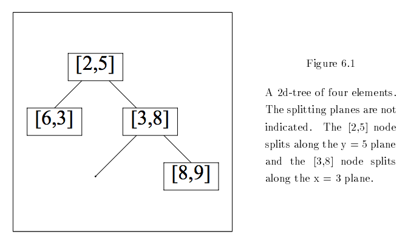
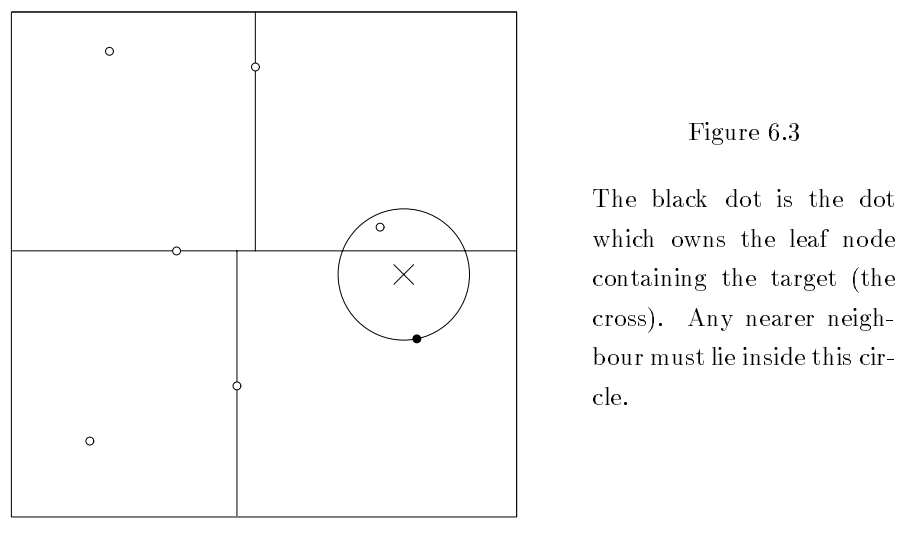
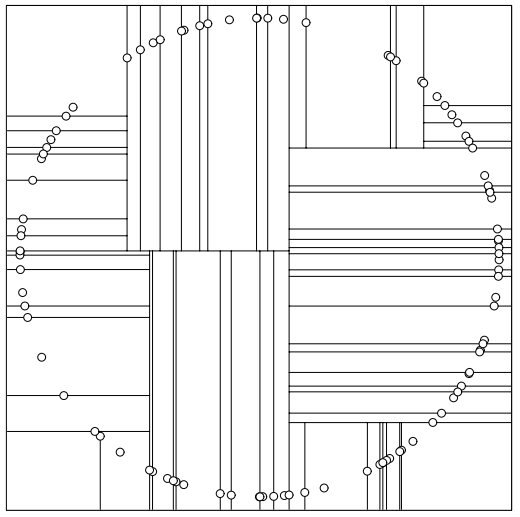

# Machine Learning: Use Cases

Contents

* <a href="#visualization">Visualization</a>
* <a href="#k-means">K-Means Clustering</a>
* <a href="#transfer">Transfer Learning</a>
* <a href="#knn">K-Nearest Neighbors</a>
* <a href="#vp">VP Tree</a>

The features learned by deep neural networks can be used for the purposes of classification, clustering and regression. 

Neural nets are simply universal approximators using non-linearities. They produce "good" features by learning to reconstruct data through pretraining or through backpropagation. In the latter case, neural nets plug into arbitrary loss functions to map inputs to outputs.

The features learned by neural networks can be fed into any variety of other algorithms, including traditional machine-learning algorithms that group input, softmax/logistic regression that classifies it, or simple regression that predicts a value. 

So you can think of neural networks as feature-producers that plug modularly into other functions. For example, you could make a convolutional neural network learn image features on ImageNet with supervised training, and then you could take the activations/features learned by that neural network and feed it into a second algorithm that would learn to group images.

Here is a list of use cases for features generated by neural networks:

## <a name="visualization">Visualization</a>

**[t-distributed stochastic neighbor embedding (T-SNE)](https://en.wikipedia.org/wiki/T-distributed_stochastic_neighbor_embedding)** is an algorithm used to reduce high-dimensional data into two or three dimensions, which can then be represented in a scatterplot. T-SNE is used for finding latent trends in data. Deeplearning4j relies on T-SNE for some visualizations, and it is an interesting end point for neural network features. For more information and downloads, see this [page on T-SNE](https://lvdmaaten.github.io/tsne/).

**Renders** - Deeplearning4j relies on visual renders as heuristics to monitor how well a neural network is learning. That is, renders are used to debug. They help us visualize activations over time, and activations over time are an indicator of what and how much the network is learning. 

## <a name="k-means">K-Means Clustering</a>

K-Means is an algorithm used for automatically labeling activations based on their raw distances from other input in a vector space. There is no target or loss function; k-means picks so-called  *centroids*. K-means creates centroids through a repeated averaging of all the data points.  K-means classifies new data by its proximity to a given centroid. Each centroid is associated with a label. This is an example of unsupervised learning (learning lacking a loss function) that applies labels. 

## <a name="transfer">Transfer Learning</a>

Transfer learning takes the activations of one neural network and puts them to use as features for another algorithm or classifier. For example, you can take the model of a ConvNet trained on ImageNet, and pass fresh images through it into another algorithm, such as K-Nearest Neighbor. The strict definition of transfer learning is just that: taking the model trained on one set of data, and plugging it into another problem. 

## <a name="knn">K-Nearest Neighbors</a>

Mike Depies has written a tutorial about how to combine [Deeplearning4j and K-Nearest Neighbor here](https://depiesml.wordpress.com/2015/09/03/learn-by-implementation-k-nearest-neighbor/).

This algorithm serves the purposes of classification and regression, and relies on a kd-tree. A [kd-tree](https://en.wikipedia.org/wiki/K-d_tree) is a data structure for storing a finite set of points from a k-dimensional space. It partitions a space of arbitrary dimensions into a tree, which may also be called a *vantage point tree*. kd-trees subdivide a space with a tree structure, and you navigate the tree to find the closest points. The label associated with the closest points is applied to input. 

Let your input and training examples be vectors. Training vectors might be arranged in a binary tree like so:

 

If you were to visualize those nodes in two dimensions, partitioning space at each branch, then the kd-tree would look like this:

 

Now, let's saw you place a new input, X, in the tree's partitioned space. This allows you to identify both the parent and child of that space within the tree. The X then constitutes the center of a circle whose radius is the distance to the child node of that space. By definition, only other nodes within the circle's circumference can be nearer. 

 

And finally, if you want to make art with kd-trees, you could do a lot worse than this:

 

*(Hat tip to [Andrew Moore of CMU](http://www.autonlab.org/autonweb/14665/version/2/part/5/data/moore-tutorial.pdf?branch=main&language=en) for his excellent diagrams.)*

### <a name="vp">VP Tree</a>

The underlying implementation for K Nearest Neighbors is the [VP Tree](https://github.com/deeplearning4j/deeplearning4j/blob/master/deeplearning4j-core/src/main/java/org/deeplearning4j/clustering/vptree/VPTree.java#L59-59), which we've implemented here. You can think of it as a search engine for coordinate spaces.

### Other Resources

* [Introduction to Deep Neural Networks](./neuralnet-overview.html)
* [MNIST for Beginners](./mnist-for-beginners.html)
* [Deeplearning4j Quickstart Examples](./quickstart.html)
* [ND4J: Numpy for the JVM](http://nd4j.org)
