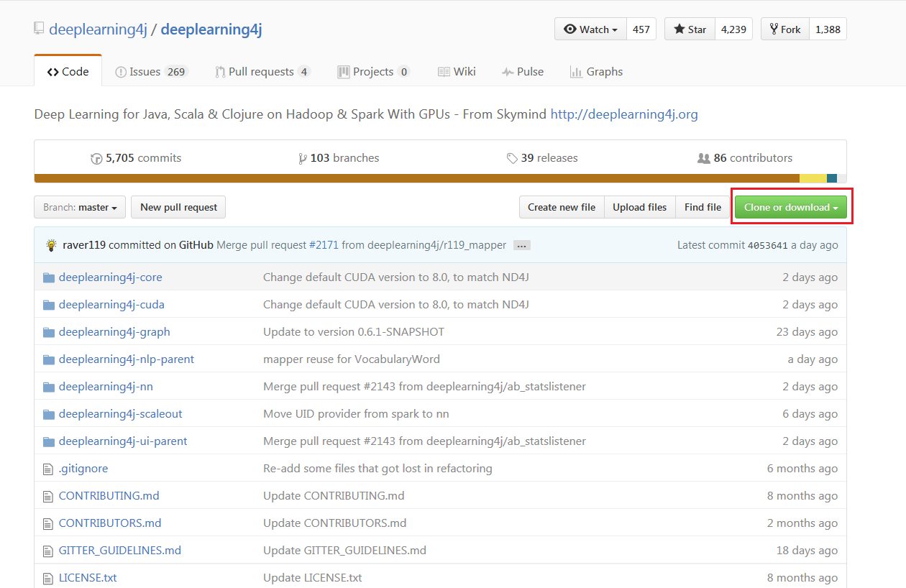
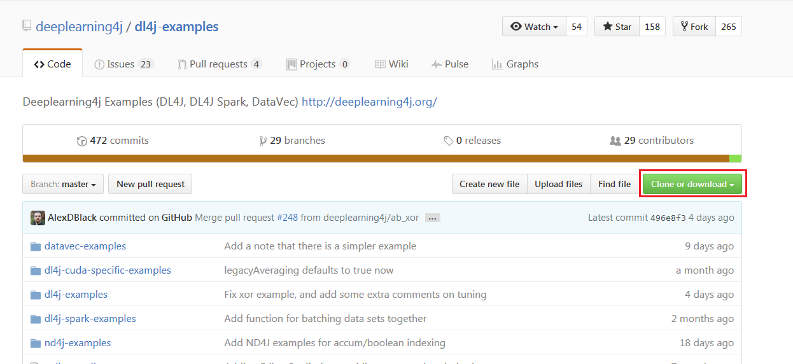
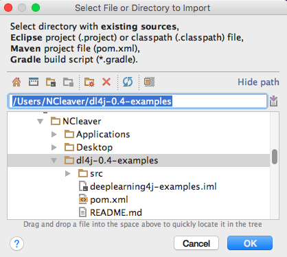

<!-- Begin Inspectlet Embed Code -->
<script type="text/javascript" id="inspectletjs">
window.__insp = window.__insp || [];
__insp.push(['wid', 1755897264]);
(function() {
function ldinsp(){if(typeof window.__inspld != "undefined") return; window.__inspld = 1; var insp = document.createElement('script'); insp.type = 'text/javascript'; insp.async = true; insp.id = "inspsync"; insp.src = ('https:' == document.location.protocol ? 'https' : 'http') + '://cdn.inspectlet.com/inspectlet.js'; var x = document.getElementsByTagName('script')[0]; x.parentNode.insertBefore(insp, x); };
setTimeout(ldinsp, 500); document.readyState != "complete" ? (window.attachEvent ? window.attachEvent('onload', ldinsp) : window.addEventListener('load', ldinsp, false)) : ldinsp();
})();
</script>
<!-- End Inspectlet Embed Code -->

Eclipse Quick Start
=================

This is a step-by-step tutorial for those who prefer Eclipse IDE without using Maven. It is intended for those familiar with Eclipse and have a recent version installed.

## Links

http://www.eclipse.org/downloads/
http://www.oracle.com/technetwork/java/javase/downloads/index.html
http://commons.apache.org/
https://github.com/deeplearning4j/deeplearning4j 
https://github.com/deeplearning4j/dl4j-examples

## Prerequisites

* [Java (developer version)](#Java) 1.7 or later (**Only 64-Bit versions supported**)
* Eclipse 4.3 or newer
* Basic understanding of Java language
* GIT client - optional

If you don't have Eclipse or JDK1.7 installed, please do that before proceeding.

### <a name="GetDL4J">Getting Deep Learning 4 Java</a>

The first step is to download DeepLearning4J and the examples. If you have an existing Github account with github client installed, use the GIT instructions. If you're new to GIT and don't have access to Github client due to corporate firewalls and restrictions, use without GIT instructions.

#### <a name="WithGIT">With GIT</a>

1. Start GIT shell
2. Change to the folder where you want to clone DL4J
3. Run "git clone https://github.com/deeplearning4j/deeplearning4j [local name]" - replace the last parameter with the name of the folder you would like on your system. Note that if you've already forked the project on Github, replace the url with the URL of your fork.
4. Run "git clone https://github.com/deeplearning4j/dl4j-examples [local name]" - replace the last parameter with the name of the folder you would like on your system.

#### <a name="WithOutGIT">Without GIT</a>

1. Open a browser
2. Go to https://github.com/deeplearning4j/deeplearning4j
3. Click "clone or download" and select "download zip"

4. Go to https://github.com/deeplearning4j/dl4j-examples
5. Click "clone or download" and select "download zip"

6. Unzip both files to a folder. I used Github client to clone both repositories


## <a name="examples">DL4J Examples in a Few Easy Steps</a>

1. Use command line to enter the following:

        $ git clone https://github.com/deeplearning4j/dl4j-examples.git
        $ cd dl4j-examples/
        $ mvn clean install

2. Open IntelliJ and choose Import Project. Then select the main 'dl4j-examples' directory. (Note that it is dl4j-0.4-examples on pictures, that is an outdated repository name, you should use dl4j-examples everywhere).



3. Choose 'Import project from external model' and ensure that Maven is selected. 


4. Continue through the wizard's options. Select the SDK that begins with `jdk`. (You may need to click on a plus sign to see your options...) Then click Finish. Wait a moment for IntelliJ to download all the dependencies. You'll see the horizontal bar working on the lower right.

5. Pick an example from the file tree on the left.

Right-click the file to run. 


## Next Steps

1. Join us on Gitter. We have three big community channels.
  * [DL4J Live Chat](https://gitter.im/deeplearning4j/deeplearning4j) is the main channel for all things DL4J. Most people hang out here.
  * [Tunning Help](https://gitter.im/deeplearning4j/deeplearning4j/tuninghelp) is for people just getting started with neural networks. Beginners please visit us here!
  * [Early Adopters](https://gitter.im/deeplearning4j/deeplearning4j/earlyadopters) is for those who are helping us vet and improve the next release. WARNING: This is for more experienced folks. 
2. Read the [introduction to deep neural networks](./neuralnet-overview) or [one of our detailed tutorials](./tutorials). 
3. Check out the more detailed [Comprehensive Setup Guide](./gettingstarted).
4. Browse the [DL4J documentation](./documentation).

### Additional links

- [Deeplearning4j artifacts on Maven Central](http://search.maven.org/#search%7Cga%7C1%7Cdeeplearning4j)
- [ND4J artifacts on Maven Central](http://search.maven.org/#search%7Cga%7C1%7Cnd4j)
- [Datavec artifacts on Maven Central](http://search.maven.org/#search%7Cga%7C1%7Cdatavec)

### Troubleshooting

**Q:** I'm using a 64-Bit Java on Windows and still get the `no jnind4j in java.library.path` error

**A:** You may have incompatible DLLs on your PATH. To tell DL4J to ignore those, you have to add the following as a VM parameter (Run -> Edit Configurations -> VM Options in IntelliJ):

```
-Djava.library.path=""
```
