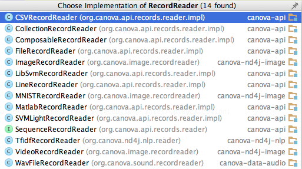

---
title:DataVec - A Vectorization and ETL Library
layout: default
---

# DataVec:ベクトル化とETLライブラリ

DataVecは、データをニューラルネットワークが理解できる形態に変換する、という機械学習やディープラーニングを効果的に行うには避けることのできない課題を解決します。ニューラルネットワークが理解できるのはベクトルという形態です。そしてベクトル化がデータを使ってアルゴリズムのトレーニングを開始する際に多くのデータ科学者が最初に解決しなければならない問題です。使用するデータが、数値に変換して取り込まなければならないフラットファイルに保存されたCSV（カンマで区切られた値）フォーマットである場合、またはラベル付けされた画像のディレクトリ構造のデータである場合は、DataVecがDeepLearning4Jで使用する際にデータをオーガナイズするツールとして役立ちます。 


DataVecを使用する前は、**このページの説明はすべて読んでください**。特に後出するセクションの「[レコードを読む](#record)」は重要です。


## 初心者用ビデオ

画像データのベクトル変換についての説明ビデオです。 

<iframe width="420" height="315" src="https://www.youtube.com/embed/EHHtyRKQIJ0" frameborder="0" allowfullscreen></iframe>

## 重要な特徴
- [DataVec](https://github.com/deeplearning4j/DataVec)は入力/出力フォーマットシステムを使用します（Hadoop MapReduceがInputFormatを使用してInputSplitsやRecordReadersを決定するのに似て、DataVecもデーターをシリアル化するためにRecordReadersを提供します）。
- すべての主要な入力データの種類（テキスト、CSV、オーディオ、画像、ビデオ）をそれぞれのフォーマットのままで対応できるように設計されています。
- 出力フォーマットシステムを使用して、実装がニュートラル状態である種類のベクトルフォーマット（ARFF、SVMLightなど）を指定できるようにします。
- 特殊な入力フォーマットにエクステンション可能です（変わった画像フォーマットなど）。自分用にカスタム化した入力フォーマットを書き、残りのコードベースに変換パイプラインの処理をさせることができます。
- ベクトル化が第一級オブジェクトになります。
- データを変換し正規化する組み込みツールです。
- DataVec Javadocについては[こちら](http://deeplearning4j.org/datavecdoc/)をお読みください。

簡単なチュートリアルは<a href="#tutorial">以下</a>をお読みください。

## いくつかの例

 * CSVベースのUCI IrisデータセットをsvmLightオープン・ベクトル・テキストのフォーマットに変換
 * MNISTデータセットを生のバイナリファイルからsvmLight テキストのフォーマットに変換
 * 生のテキストをMetronomeベクトルのフォーマットに変換
 * 生のテキストをテキストベクトルのフォーマット{svmLight, metronome, arff}でTF-IDFベースのベクトルに変換
 * 生のテキストをテキストベクトルのフォーマット{svmLight, metronome, arff}でword2vecに変換

## ターゲットのベクトル化エンジン

 * 任意のCSVからスクリプト可能な変換言語のベクトル
 * MNISTTからベクトル
 * テキストからベクトル
    * TF-IDF
    * 単語の袋（Bag of Words）
    * word2vec

## CSV変換エンジン

データが数値で適切にフォーマットされていれば、CSVRecordReaderに問題はないでしょう。しかし、ブーリアン型(T/F)やラベル用の文字列など、データに数字でないフィールドがあれば、スキーマ変換が必要になります。DataVecはApache [Spark](http://spark.apache.org/) を使用して変換作業を行っています。*DataVecの変換を成功させるのにSparkの内部を知る必要はありません。

## スキーマ変換のビデオ

コード付きの簡単なDataVecの変換に関するチュートリアル・ビデオは下記をご覧ください。
<iframe width="560" height="315" src="https://www.youtube.com/embed/MLEMw2NxjxE" frameborder="0" allowfullscreen></iframe>

## exampleのJava Code

弊社の[examples](https://deeplearning4j.org/quickstart#examples)には、DataVecのexampleを集めたものが含まれています。   

<!-- Note to Tom, write DataVec setup content

## <a name="tutorial">DataVecのセットアップ</a>

Maven Centralで[DataVec](https://search.maven.org/#search%7Cga%7C1%7CDataVec)を検索し、使用可能なJARのリストを入手します。

依存関係の情報をpom.xmlに追加します。

-->


## <a name="record">データをイテレートしてレコードを読む</a>

以下のコードは、ある1つのexample（生の画像）をDL4JやND4Jで使用できるフォーマットに変換する方法を示しています。

``` java
// RecordReaderをインストールします。画像の縦と横の長さを指定します。
RecordReader recordReader = new ImageRecordReader(28, 28, true, labels);

// データパスを指します。 
recordReader.initialize(new FileSplit(new File(labeledPath)));
```

RecordReaderは、DataVecにあるクラスで、バイト指向の入力データを決まった数値を持ち、独自のIDを割り当てられた要素の集合であるレコード指向のデータに変換します。データをレコードに変換するのはベクトル化の工程です。レコード自体がベクトルで、その各要素が特徴になっています。

[ImageRecordReader](https://github.com/deeplearning4j/DataVec/blob/a64389c08396bb39626201beeabb7c4d5f9288f9/datavec-data/datavec-data-image/src/main/java/org/datavec/image/recordreader/ImageRecordReader.java)はRecordReaderのサブクラスで、自動的に28 x 28ピクセルの画像を取り込むように構築されています。したがって、LFW画像は28ピクセル x 28ピクセルにスケーリングされます。画像の縦の長さ x 横の長さの積であるハイパーパラメータの`nIn`を調節しさえすれば、ImageRecordReaderに入力したパラメータを変更してカスタム化された画像と一致するように長さを変更することができます。 

その他の上述のパラメータにはリーダーにレコードへのラベル付与を指導する`true`、そしてニューラルネットワークモデルの結果を検証するのに使用される教師付きの値（ターゲットなど）の配列である`labels`が含まれます。ここにはDataVecで事前に構築されたRecordReaderのエクステンションがすべてあります（IntelliJの`RecordReader`を右クリックし、ドロップダウンメニューの`Go To`をクリックし、`Implementations`を選択すると見つかります）。



DataSetIteratorはリスト内の要素を巡回するDeeplearning4Jのクラスです。イテレーターはデータのリストを通過し、それぞれに連続的にアクセスし、現在の要素を指すことによりどのぐらい進んだかを追跡し、巡回中に次の要素とそれぞれの新しいステップを指すように自らを修正します。

``` java
// DataVecからDL4J
DataSetIterator iter = new RecordReaderDataSetIterator(recordReader, 784, labels.size());
```

DataSetIteratorは入力データベースにイテレートし、各イテレーションにつき1つ以上のexampleを取り出し、これらのexampleをニューラルネットワークが作業できるDataSetのオブジェクトに読み込みます。上記のコマンドラインは、[RecordReaderDataSetIterator](https://github.com/deeplearning4j/deeplearning4j/blob/3e5c6a942864ced574c7715ae548d5e3cb22982c/deeplearning4j-core/src/main/java/org/deeplearning4j/datasets/canova/RecordReaderDataSetIterator.java)に画像を28 x 28の格子（行列など）でなく一列（ベクトルなどの）に並べられた要素に変換するよう指示します。また可能なラベル数を指定します。

`RecordReaderDataSetIterator`はパラメータとして特定のrecordReader（画像、サウンド用に）やバッチサイズを取ることができます。教師付き学習には、ラベル・インデックスや入力データに適用できる可能なラベル数も取ります（LFWについては、ラベル数は5,749）。 

DataVecからDeeplearning4jにデータを移動させるその他のステップの手順については、[こちら](./simple-image-load-transform)でカスタム化された画像データパイプラインについてをお読みください。

## 実行

ローカルな連続的工程、そしてMapReduce（ロードマップのMRエンジン）スケールアウト工程として実行され、コード変更しません。

## ターゲットのベクトルフォーマット
* svmLight
* libsvm
* Metronome
* ARFF

## 一般的な組み込み機能
* カーネルハッシュや単語の出現頻度 - 逆文書頻度などの通常のテクニックを使用して一般的なテキストを取り入れ、ベクトルに変換する方法。
