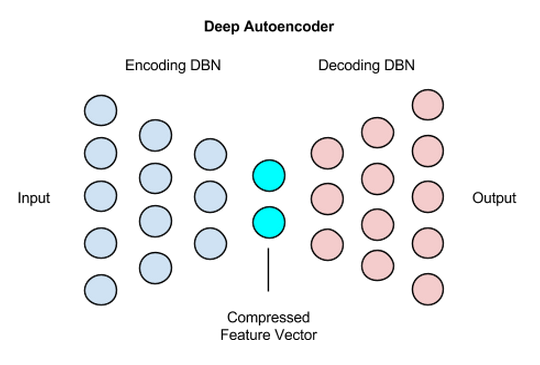

- - -
title:Deep Autoencoders
layout: default
---

# ディープオートエンコーダ

ディープオートエンコーダは、通常4～5つの浅い層からなるエンコーディング部分と4～5つの層からなるデコーディング部分の2対の対称的な[ディープ・ビリーフ・ネットワーク](./deepbeliefnetwork.html)で構成されています。
これらの層は、[制限付きボルツマン・マシン](./restrictedboltzmannmachine.html)というディープ・ビリーフ・ネットワークのビルディングブロックなのですが、いくつかの特徴があります。ディープオートエンコーダの構造を簡略化すると以下のようになります。

 

ディープオートエンコーダはベンチマークのデータセットである[MNIST](http://yann.lecun.com/exdb/mnist/)を処理し、制限付きボルツマン・マシンの後にバイナリ変換を使用します。ディープオートエンコーダは実数値のデータで構成されるその他のデータセットにも使用できます。これらには制限付きボルツマン・マシンに適用するガウスの正規化変換を使用します。 

### エンコーディング

エンコーダの例を下にお見せしましょう。
    
     784（入力）----> 1000 ----> 500 ----> 250 ----> 100 -----> 30

ネットワークに送り込まれる入力データが、784画素（MNISTデータセット内の28 x 28画素の画像）であったとすると、ディープオートエンコーダの最初の層には少し大きめの1000パラメータが必要です。 

このように入力データよりパラメータが多いと過剰適合になりかねないため、普通に考えるとこれは逆にしなければならないのではないかと思われるかもしれません。 

しかしこの場合、パラメータを増やし、ある意味で入力データ自体の特徴を増大させると、オートエンコードされたデータを少しづつデコードすることが可能になるのです。 

これは、各層で使用される変換形式であるシグモイド・ビリーフ・ユニットの表現能力が関係しています。シグモイド・ビリーフ・ユニットは、実数値のデータほど多く、また多様性のある情報を表現することができません。最初の層が拡張されるのはそれを補うための1つの方法です。 

各層はノード数がそれぞれ順に1000、500、250、100個となっており、最後の層のネットワークは数字30個のベクトルを出力します。この数字30個のベクトルは、ディープ・オートエンコーダの前半部（事前トレーニングを行う半分）の最後の層に当たり、Softmaxやロジスティック回帰などの分類出力層というより一般的な制限付きボルツマン・マシンのプロダクトで、通常ディープ・ビリーフ・ネットワークの最後にあります。 

### デコーディング

これらの数字30個は、28 x 28画素の画像がエンコードされたものです。ディープ・オートエンコーダの後半部は、凝縮された（condensed）ベクトルをデコードする方法を実際に学習します。そしてそれが戻ると入力データになります。

このデコーディングを行うディープ・オートエンコーダの後半部は、フィードフォワードネットワークになっています。各層はノード数がそれぞれ順に100、250、500、1000個となっています。 
層の重量は無作為に初期化されます。 

		784(出力）<---- 1000 <---- 500 <---- 250 <---- 30

このデコーディングを行うディープ・オートエンコーダの後半部では、画像の再構築を学習します。これは逆伝播も行う、二つ目のフィードフォワードネットワークを使って行います。逆伝播は、再構成エントロピーを通じて行われます。

### ニュアンスのトレーニング

デコーダの逆伝播の段階では、対象としているのがバイナリデータか連続データかによって1e-3から1e-6までの範囲で学習率を低下させる、または速度を落とす必要があります。

## ユースケース

### 画像検索

上述のように、ディープオートエンコーダは画像を数字30個のベクトルに圧縮させることができます。 

従って、画像検索とは、画像をアップロードすると、検索エンジンがそれを数字30個のベクトルへと圧縮し、インデックス内でその他すべてのベクトルと比較するという作業なのです。 

同数の数字を含むベクトルは検索クエリーを行うために返され、マッチする画像に変換されます。 

### データ圧縮

より一般的な画像圧縮のケースはデータ圧縮です。ディープエンコ―ダは、Geoff Hinton氏による[こちら](https://www.cs.utoronto.ca/~rsalakhu/papers/semantic_final.pdf)の論文で言及されているようにセマンティックハッシングに役立ちます。

### トピックモデリングおよび情報検索（IR）

ディープオートエンコ―ダはトピックモデリング、または複数の文書に分散する抽象的なトピックを統計的にモデリングするのに役立ちます。 

また、これはワトソンのような質問応答システムには重要な段階です。

簡単に言うと、文書はそれぞれ単語の袋（Bag-of-Words、単語数のセット）に変換されます。そしてこれらの単語数は、文書内の単語出現頻度と解釈されるような0から1の間の小数点を含む値に縮小されます。 

次に、縮小された単語数は制限付きボルツマン・マシンのスタックであるディープ・ビリーフ・ネットワークに入力されます。そして制限付きボルツマン・マシン自体はフィードフォワード-逆伝播オートエンコーダの単なるサブセットです。これらのディープ・ビリーフ・ネットワーク（DBN）は、特徴空間にマッピングする一連のシグモイド変換によって各文書を数字10個に圧縮します。 

それから各文書の数字セットであるベクトルは同じベクトル空間に導入され、その他すべての文書-ベクトルとの距離が測定されます。大まかにいうと、近くの文書-ベクトルが同じトピックに当たります。 

例えば、ある文書は「質問」でその他は「応答」というようにソフトウェアがベクトル-空間測定を使用してマッチさせます。 

## コードの例

ディープエンコーダは、Deeplearning4jの[MultiLayerNetworkクラス](https://github.com/deeplearning4j/deeplearning4j/blob/3e934e0128e443a0e187f5aea7a3b8677d9a6568/deeplearning4j-core/src/main/java/org/deeplearning4j/nn/multilayer/MultiLayerNetwork.java)を延長させて構築することができます。

そのコードは以下のようになります。

```
package org.deeplearning4j.examples.unsupervised.deepbelief;

import org.deeplearning4j.datasets.fetchers.MnistDataFetcher;
import org.deeplearning4j.datasets.iterator.impl.MnistDataSetIterator;
import org.deeplearning4j.nn.api.OptimizationAlgorithm;
import org.deeplearning4j.nn.conf.MultiLayerConfiguration;
import org.deeplearning4j.nn.conf.NeuralNetConfiguration;
import org.deeplearning4j.nn.conf.layers.OutputLayer;
import org.deeplearning4j.nn.conf.layers.RBM;
import org.deeplearning4j.nn.multilayer.MultiLayerNetwork;
import org.deeplearning4j.optimize.api.IterationListener;
import org.deeplearning4j.optimize.listeners.ScoreIterationListener;
import org.nd4j.linalg.activations.Activation;
import org.nd4j.linalg.dataset.DataSet;
import org.nd4j.linalg.dataset.api.iterator.DataSetIterator;
import org.nd4j.linalg.lossfunctions.LossFunctions;
import org.slf4j.Logger;
import org.slf4j.LoggerFactory;

import java.util.Collections;

/**
 * ***** 注:この例は調節されていません。適切な結果を出すにはさらなる作業が必要です。*****
 *
 * @author Adam Gibson
 */
public class DeepAutoEncoderExample {

    private static Logger log = LoggerFactory.getLogger(DeepAutoEncoderExample.class);

    public static void main(String[] args) throws Exception {
        final int numRows = 28;
        final int numColumns = 28;
        int seed = 123;
        int numSamples = MnistDataFetcher.NUM_EXAMPLES;
        int batchSize = 1000;
        int iterations = 1;
        int listenerFreq = iterations/5;

        log.info("Load data....");
        DataSetIterator iter = new MnistDataSetIterator(batchSize,numSamples,true);

        log.info("Build model....");
        MultiLayerConfiguration conf = new NeuralNetConfiguration.Builder()
                .seed(seed)
                .iterations(iterations)
                .optimizationAlgo(OptimizationAlgorithm.LINE_GRADIENT_DESCENT)
                .list()
                .layer(0, new RBM.Builder().nIn(numRows * numColumns).nOut(1000).lossFunction(LossFunctions.LossFunction.KL_DIVERGENCE).build())
                .layer(1, new RBM.Builder().nIn(1000).nOut(500).lossFunction(LossFunctions.LossFunction.KL_DIVERGENCE).build())
                .layer(2, new RBM.Builder().nIn(500).nOut(250).lossFunction(LossFunctions.LossFunction.KL_DIVERGENCE).build())
                .layer(3, new RBM.Builder().nIn(250).nOut(100).lossFunction(LossFunctions.LossFunction.KL_DIVERGENCE).build())
                .layer(4, new RBM.Builder().nIn(100).nOut(30).lossFunction(LossFunctions.LossFunction.KL_DIVERGENCE).build()) //encoding stops
                .layer(5, new RBM.Builder().nIn(30).nOut(100).lossFunction(LossFunctions.LossFunction.KL_DIVERGENCE).build()) //decoding starts
                .layer(6, new RBM.Builder().nIn(100).nOut(250).lossFunction(LossFunctions.LossFunction.KL_DIVERGENCE).build())
                .layer(7, new RBM.Builder().nIn(250).nOut(500).lossFunction(LossFunctions.LossFunction.KL_DIVERGENCE).build())
                .layer(8, new RBM.Builder().nIn(500).nOut(1000).lossFunction(LossFunctions.LossFunction.KL_DIVERGENCE).build())
                .layer(9, new OutputLayer.Builder(LossFunctions.LossFunction.MSE).activation(Activation.SIGMOID).nIn(1000).nOut(numRows*numColumns).build())
                .pretrain(true).backprop(true)
                .build();

        MultiLayerNetwork model = new MultiLayerNetwork(conf);
        model.init();

        model.setListeners(new ScoreIterationListener(listenerFreq));

        log.info("Train model....");
        while(iter.hasNext()) {
            DataSet next = iter.next();
            model.fit(new DataSet(next.getFeatureMatrix(),next.getFeatureMatrix()));
        }


    }


}

```
       

ディープオートエンコーダを構築するには、最新の[Deeplearning4jおよびそのいくつかのexample](https://github.com/deeplearning4j/dl4j-examples/tree/master/dl4j-examples/src/main/java/org/deeplearning4j/examples/unsupervised/deepbelief)を入手してください。

ディープオートエンコーダについての質問は、[Gitter](https://gitter.im/deeplearning4j/deeplearning4j)から弊社にお問合せください。 
