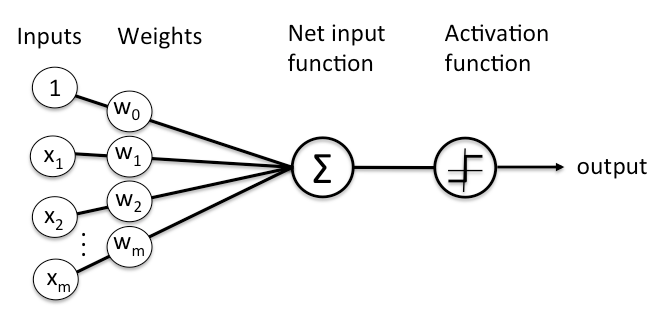
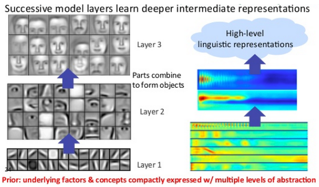

# ディープニューラルネットワークについて

目次

* <a href="#define">ニューラルネットワークとは？</a>
* <a href="#element">ニューラルネットワークの構成要素</a>
* <a href="#concept">ディープ・ニューラル・ネットワークの重要概念</a>
* <a href="#forward">例：順伝播型ネットワーク＆誤差逆伝播法</a>
* <a href="#regression">多重線形回帰</a>
* <a href="#logistic">ロジスティック回帰＆分類</a>
* <a href="#ai">ニューラルネットワーク＆人口知能（AI）</a>
* <a href="#intro">その他の説明ガイドリソース</a>

## 

ニューラルネットワークは、人間の脳を模倣したアルゴリズムの一式で、パターンが認識できるように設計されています。一種の機械知覚により感覚データを解釈し、生の入力情報にラベルを付け、クラスタリングします。その認識するパターンはベクトルの中にある数値です。実際の社会にあるすべてのデータは、画像、音、テキスト、時系列であっても、数値に変換されます。 

ニューラルネットワークは、データをクラスタリングや分類するのに役立ちます。ニューラルネットワークとは、保管または管理されるデータの上でクラスタリングや分類作業を行う層であると考えるといいでしょう。サンプル入力の中で、ラベルが付いていないデータを類似性に基づいてグループ化するのを助けます。そして、ラベル付きのトレーニング可能なデータセットがあると、データを分類します。（正確に言うと、ニューラルネットワークが抽出する特徴は、他のアルゴリズムに入力され、クラスタリングや分類がされます。従って、ディープ・ニューラル・ネットワークは、[強化学習（reinforcement learning）](../reinforcementlearning.html)、分類、[回帰（regression）](../linear-regression.html)を行うためのアルゴリズムが導入された、より大型の機械学習アプリケーションの構成要素の一つであると考えていいでしょう。）

ディープラーニングに解決させる問題を一つ考える時には、関心があるのはどのようなカテゴリーか、どのような情報をベースにするといいかを考えてみてください。それらの答えが、データに適用されるラベルに当たります。例えば、`spam`か`not_spam`、`good_guy`か`bad_guy`、`angry_customer`か`happy_customer`などです。次に、自分は、それらのラベルを付けるデータを持っているか、ラベルの付いたデータを見つけることができるか、ラベルと入力の相関性をアルゴリズムに教えるために使用するラベル付きデータセットを作成することができるか（Amazon Mechanical TurkやCrowdflowerなどのサービスを使って）を考えてみてください。

例えば、癌に罹る恐れのある人々のグループを特定したい場合のトレーニングセットとは、癌に罹った人々と癌に罹っていない人々の一覧、そしてそれらの人々それぞれのIDに関連したすべてのデータ、のようなものになるでしょう。このIDには、年齢、喫煙習慣の有無などの明示的な特徴から、ライフスタイル、習慣、興味、リスクなどがよく分かる行動を追跡した時系列などの生データ、オンライン行動の記録までも含まれます。 

このようなデータセットを使って、ニューラルネットワークをトレーニングし、人々が癌患者か否かで分類し、その分類モデルを使って、癌のリスクが未知である人々に適用し、癌のリスクを予測し、リスクがある人々により注意を向け、予防対策を立てることができるのです。 

恋愛のパートナーとして適格な人、未来にメジャーリーグのスーパースターとなるだろう人、将来が有望な社員、俳優として将来いい演技が期待できない人などを探すのにも同じような過程を経て行います。つまり、必要不可欠な統計やソーシャルグラフ、コミュニケーションの生テキスト、クリックストリームなどを集めてトレーニングセットを作成し、探している人々とそうでない人々のデータを比較してパターンや対象である人々を明らかにするのです。 

## <a name="element">ニューラルネットワークの構成要素</a>

ディープラーニングとは、層がいくつか積み重なったニューラルネットワークです。そしてそれらの層は、ノード（節）で構成されています。ノードとは計算が行われる場所で、人間の神経細胞を模倣したものであり、十分な量の刺激を受けると、発火します。ノードにデータが入力されると一式の係数、または重みと言って、その入力データの増幅や減衰を行うものが組み合わされます。このような方法で、アルゴリズムが学習するタスクの中で、入力データの重要性が割り当てられます。入力に複数の重みが組み合わされた後、それらを合計したものがノードの活性化を行う部分を通過します。ここでは、これらの信号はネット内を進んでいくのか、そうであればどの程度進んで最終的な結果に影響するのか、などを決める一種の分類作業が行われます。 

ノードの構成を図にすると、このようになります。

ノード層とは、神経細胞のスイッチのようなものが並んだもので、ネットワークに入力があると、オン/オフと切り替えます。最初の層が入力データを受け取ることから始まり、それぞれの層の出力が次の層の入力となります。ます。  

入力した特徴に調整可能な重みをそれぞれ組みわせることにより、その特徴に重要性の度合いを割り当て、ネットワークはこれを基にして入力を分類し、クラスタリングします。 

## <a name="concept">ディープ・ニューラル・ネットワークの重要概念</a>

ディープラーニングが一般に隠れ層が1つの他のニューラルネットワークとは異なるという点は、ディープラーニングは**深層**である、つまりデータが多くのノード層を、複数の段階にわたるパターン認識を行いながら通過する、というところです。 

従来の機械学習の場合、ネットワークの層は薄く、入力層と、出力層がそれぞれ1層づつあるのみです。多ければ、その中間に隠れ層がもう一つあるくらいです。ネットワークが4層以上（入力層と出力層を含む）だと、「ディープ（深層）」ラーニングと呼ばれます。したがって、厳密にいえば、ディープとは、隠れ層が2つ以上あるものと定義されます。 

ディープラーニング・ネットワークでは、各ノード層は、前の層から受けた出力を基にして新しく別の特徴一式でトレーニングします。ニューラルネットワーク内を進めば進むほど、ノードはさらに複雑な特徴を認識できるようになります。この理由は、各層は、前の層が処理した特徴を集めて、再び組み合わせるからです。 

これは、 **特徴の階層（feature hierarchy）** と呼ばれ、複雑さと抽象さの度合を示す階層なのです。このため、ディープラーニング・ネットワークは、[非線形関数（nonlinear functions）](../glossary.html#nonlineartransformfunction)を通過する何十億ものパラメータを持つ、大規模で高次元のデータセットを処理することができるのです。 

とりわけ、これらのネットワークは、実際の世界ではほとんどがそうである **ラベルなしの非構造化データ** 内にある潜在的な構造を発見することが可能です。非構造化データは、 *生メディア（raw media）* とも呼ばれ、写真、絵、テキスト、録画ビデオ、録音音声などがあります。従って、ディープラーニングが最も得意とすることの一つは、実際の社会から取ってきたラベルなしの生メディアを処理し、クラスタリングすることで、いまだかつて誰も関連性データベースにオーガナイズしたり名前を付けたことのないデータから類似性や例外などを識別します。 

例えば、ディープラーニングは、百万もの画像を取り入れ、類似性に基づいて、猫の写真、砕氷器の写真、自分の祖母の写った写真などを別々にクラスタリングし、処理することもできます。これがいわゆるスマートフォトアルバムと呼ばれるものの基礎です。 

同じ方法を他のデータの種類にも適用してみましょう。ディープラーニングは、生テキストである電子メールやニュース記事をクラスタリングすることもあります。怒りと伝える苦情メール、顧客の満足を伝えるメール、スパムボットなどの異なる3種類のメッセージがベクトル空間にそれぞれ別にクラスタリングされて配置されるというようなものが例に挙げられます。これが様々なメッセージング・フィルターのベースとなっており、顧客関係管理（CRM）に利用することができます。この方法をボイスメッセージにも適用することができます。 
時系列を入れると、データは、正常/健康な行動と異常/危険な行動にクラスタリングします。スマートフォンが時系列データを生成した場合、ユーザーの健康や習慣に関することが分かるでしょう。自動車部品が生成する時系列データは致命的な故障の防止に役立つかもしれません。  

ディープラーニング・ネットワークは、従来の機械学習アルゴリズムと異なり、人間の介在なしで、 **自動特徴抽出（automatic feature extraction）** を行います。特徴抽出は、データ科学者のチームが何年もかけて行う作業であるということを考えれば、ディープラーニングは、専門家の人数にに限りがあるという難点に対処するには良い方法ではないでしょうか。小規模の科学チームだと、作業できる量に限界がありますが、この作業をパワーアップしてくれます。 

ラベルなしのデータでトレーニングしているとき、ディープネットワークにある各ノード層は、ネットワークによる推測と入力データ自身の確率分布の差異を最小化するために、サンプルを引き出すための入力を繰り返し再構成しようとして、自動的に特徴を学習します。例えば、制限付きボルツマン・マシンはこの方法で再構成します。  

その過程で、これらのネットワークは、ある関連した特徴と最適な結果の相関関係を認識するのを学習します。データ全部の復元であろうと、ラベル付きデータであろうと、特徴信号とそれらの特徴が表しているものを結びつけます。 

ラベル付きデータでトレーニングを受けたディープラーニング・ネットワークは、その後、非構造化データを適用することができ、機械学習ネットワークよりも、ずっと多くの入力を受けることが可能です。これは、ニューラルネットワークの能力をより高めたい場合にお勧めの方法です。ネットワークがトレーニングに使えるデータが多ければ多いほど、より正確に判断できるようになるからです。（優秀でないアルゴリズムでも、たくさんのデータでトレーニングすれば、少しのデータでトレーニングした優秀なアルゴリズムより能力は高くなります。）ディープラーニングには、膨大な量のラベルなしデータから学習する能力があるため、従来のアルゴリズムよりずいぶん有利です。 

ディープラーニング・ネットワークは、最後に出力層で作業を終えます。ロジスティックやソフトマックス、分類器器が尤度を結果やラベルに割り当てます。我々はそれを予測と呼びますが、大まかな意味での予測です。例えば、画像という形態で、生のデータが与えられると、ディープラーニング・ネットワークは入力されたデータが、90%の確率で人間を表していると判断するでしょう。 

## <a name="forward">例：順伝播型ネットワーク</a>

ニューラルネットワークを使用する目標は、できるだけ早くエラーを最小限にさせることです。まるでレースを走っているようなものなのです。このレースは円形トラック上で行われ、同じポイントを繰り返し通過します。レースのスタートラインでは、重みが初期化され、フィニッシュラインでは、パラメターが精確な分類や予測を行うことができるようになっています。 

レース自体には、多くの段階があり、各段階はそれぞれ、その前後の段階と似ています。ランナーのように、完了するまで何度も同じアクションを繰り返します。そして、ニューラルネットワークの各段階では、推測、エラー測定、重みの微調整、係数の漸進的な調整が行われます。 

重みの集合体は、開始時でも完了後でもモデルとも呼ばれています。これは、重みがデータと正解データ（ground truth）との関係をモデル化する試みだからです。モデルは、スタート時点では、あまり能力は高くありませんが、最後の段階では、改善されています。これは、ニューラルネットワークが時を追うごとにパラメータを更新するからです。 

そして、生まれたてのニューラルネットワークは全くの無知だからです。ニューラルネットワークは、精確に推測するために、どのような重みやバイアスが入力を適切に翻訳できるのかを知りません。このため、まずは推測から開始し、間違いが生じるとそれを学習し、それを基にして、よりよい推測ができるように試みます。（ニューラルネットワークは、仮説を繰り返しテストする目隠しされた科学的方法のようなものです。）

アーキテクチャが最もシンプルで理解しやすい順伝播型ニューラルネットワークを例に挙げてみましょう。順伝播型ニューラルネットワークの場合、学習中に以下のようなことが起こります。

ネットワークに入力します。係数あるいは重みがこの入力を推測に基づいてグループにマッピングします。これを使ってネットワークが最後に推測を結果を出します。 

    入力 * 重み = 推測

重みが付けられた入力は最後にそれが何かについて推測されます。その後、ニューラルネットワークは、その推測を正解データと比較します。つまり専門家の人に「この回答で正解でしょうか？」と聞いているようなものです。 

    正解 - 推測 = エラー

ネットワークの推測と正解データの違いが*エラー*です。ネットワークは、そのエラーを測定し、エラーをモデルに戻し、エラーになった分の重みを調整します。 

    エラー * エラーに関連した重み = 調節

上記の3つの疑似数式が、ニューラルネットワークに重要な関数です。入力データのスコア付け、損失の計算、モデルの更新、そしてこの同じ3段階をまた繰り返します。ニューラルネットワークとはループ状に修正を行うためのフィードバックを送るものであり、正しく行われた推測を支援し、間違った推測には、重みにペナルティーを与えます。

上記の最初のステップを少し詳しく見てみましょう。

### <a name="multiple">多重線形回帰</a>

ニューラルネットワークは、まるで生物であるかのような名前を持っていますが、他の機械学習アルゴリズムと同様、人工のもので、単に数式やコードで構成されたものに過ぎません。実際、統計学で最初に学ぶ*線形回帰*を知っている人は誰もがニューラルネットワークの仕組みを理解することができます。最も簡単な数式では、線形回帰は、以下のように表されます。

        Y_hat = bX + a

`Y_hat`は、推測された出力結果で、Xが入力、bは傾斜で、aは2次元グラフの縦のX軸の切片です。（より具体的に言うと、Xは放射能への被ばく量でYは癌に罹るリスク、Xは毎日行う腕立て伏せの回数でYはベンチプレスで持ち上げられる全重量、Xは肥料の量でYは収穫量などが例として挙げられます。）X軸のどの位置にあろうが、Xにユニットを追加するたびに、従属変数のYはそれに比例して増加すると推測できます。この共に上下変動する簡単な2つの変数の関係がベースとなります。 

次に入力変数が多くあり、出力変数が1つである多重線形回帰を考えてください。それは、一般に以下のように表されます。

        Y_hat = b_1*X_1 + b_2*X_2 + b_3*X_3 + a

（上述した収穫量の例をさらに広げて考えていくと、日光の量、降水量、肥料の変数すべてが、`Y_hat`の結果に反映されます。）

このような多重線形回帰の計算が、ニューラルネットワークのすべてのノードで実行されています。各層のそれぞれのノードでは、その前の層の各ノードからの入力とその他のノードからの入力の新しい組み合わせを行います。入力は、それぞれの異なる係数に従って異なる割合で混ぜ合わされ、次の層の各ノードに送られます。この方法で、ネットワークは、エラーの減少を試みながら、どの入力の組み合わせが重要なのかをテストします。 

いったん、複数のノードへの入力が合計されて`Y_hat`まで行くと、非線形関数を通過します。なぜ非線形関数かというと、各ノードが多重線形回帰だけを行うと、Xが増加するごとに無限に`Y_hat`が直線上に増加します。しかし、これは我々が目的とすることとは異なるからです。 

我々が各ノードで構築しようとしているのは（神経細胞のような）スイッチで、ネットワークの最終決定に反映させるために入力信号を通過させるか否かに応じてオン、オフと切り替えができるものです。 

スイッチが設けられると、次は分類作業に取り掛かります。入力信号を受けて、ノードはそれを十分であるか否か、つまり、オンかオフに分類しますが、この二分決定は、1か0で表現されます。[ロジスティック回帰（logistic regression）](#logistic)は、非線形関数で、入力を0と1の間の空間に押し込んで翻訳します。 

各ノードでの非線形変換には、一般的にはロジスティック回帰に似たS字型関数を使います。この関数は、シグモイド（アルファベットの「S」のギリシア語）、Tanh、Hard tanhなどという名前で知られていますが、各ノードの出力を形成しています。すべてのノードの出力は、それぞれ0と1の間のS字型の空間に押し込められ、次の層では入力情報となります。層から層へと同様にして処理され、最後には信号が最後の層に着き、決定されます。 

### 勾配降下

エラーに応じて重みを調整する最適化関数は一般に「勾配降下法（gradient descent）」と呼ばれています。 

勾配（gradient）とは、別名を傾斜と言いますが、この傾斜は、x-y軸のグラフでは、二つの変数がどのように関連しているかを表します。つまりX軸の変数の移動に伴うY軸の値の上下の変動で、時間の経過に伴う貨幣価値の変動などが例です。この場合、傾斜はネットワークのエラーと重み1つの関係を表したものですから、重みが調整されるとエラーがどう変わるかという関係です。 

これをさらに具体的に言うと、どの重みが最小限のエラーを出すか、ということです。どの重みが入力データの信号を正確に表現し、正しく分類できる解釈を行うのか、どの重みが入力した画像で「nose（鼻）」と解釈でき、フライパンではなく顔としてラベルを付与するべきであると分かるのか、ということです。

ニューラルネットワークが学習を重ねるにつれて、信号を正確にマッピングできることを目指して、数多くの重みを徐々に調整していきます。ネットワークの **エラー** とそれらの **重み** との関係は微分係数*dE/dw*で表され、これは重みのわずかな変化がわずかなエラーの変化を引き起こす程度を測定します。 

重みは、多くの変換を伴うディープネットワークの要因の1つに過ぎません。重みの信号は、活性化関数を通過し、複数の層で合計されるため、我々は、[微分積分の連鎖律（chain rule of calculus）](https://ja.wikipedia.org/wiki/%E9%80%A3%E9%8E%96%E5%BE%8B)を使用することによって、ネットワークの活性化や出力に戻り、最終的には修正したい重みに行き着き、そのエラー全体との関係を調べます。 

微分積分の連鎖律は以下のように表されます。 

そして、順伝播型ニューラルネットワークの場合、ネットワークのエラーと重み1つは、以下のような式で表されます。

つまり、 **エラー** と **重み** の二つの変数の関係には、重みが通過する **活性化関数** が媒介しているため、 **重み** の変化が **エラー** の変化にどのように影響しているかを計算するには、まず最初に **活性化関数** による変化が **エラー** の変化にどのように影響しているか、ということと **重み** の変化が **活性化関数** による変化にどのように影響しているかを計算する必要があります。  

ディープラーニングの学習の本質は、重みが生み出すエラーが最小限になるまでモデルの重みを調整することなのです。 

## <a name="logistic">ロジスティック回帰</a>

数多く層で構成されたディープ・ニューラル・ネットワークの最後の層には特別な役割があります。ラベル付き情報が入力されると出力層は、各サンプルを分類し、最も正解である可能性の高いラベルを付与します。出力層にある各ノードがラベル1つを表しており、前の層から信号とパラメーターを受け取ると、その強度に応じてスイッチを入れたり切ったりします。 

それぞれの出力ノードは、可能性が2つのバイナリ値である0または1を生成します。[入力変数は、ラベルが付与できるかできないかのどちらかだからです](https://ja.wikipedia.org/wiki/%E6%8E%92%E4%B8%AD%E5%BE%8B)。例えば、少しだけ妊娠している、などという状態はあり得ないのです。  

ニューラルネットワークは、ラベル付きのデータを処理すると出力にバイナリ値を生成しますが、受け取る入力は多くの場合、連続的なものです。つまり、ネットワークの受け取る入力信号は、解決しようとする問題によって、その値はあらゆる域にあり、測定基準も様々なものがあるのです。 

例えば、リコメンデーションエンジンは、広告を提供するか否かの2つの選択肢から選択して決断しなければなりません。ところが、その決断を行うためのベースとするために受け取る入力情報自体は、Amazonで先週どのくらいの額を支払ったのか、またどのくらいの頻度でそのサイトへ行くか、などです。 

ですから、出力層は、おむつに$67.59の支払い、ウェブサイトに15回行ったなどといった内容の信号を0と1の間に押し込むことにより、入力にラベルを付けるか付けないかの可能性を表さなければなりません。 

連続的な信号をバイナリ値の出力に変換していく仕組みは、ロジスティック回帰と呼ばれます。しかしここでロジスティック回帰を多くの人がよく知っている線的回帰とイメージすると理解しにくくなります。ここで言うロジスティック回帰とは分類器であり、入力データセットがラベルに一致する可能性を計算します。  

上記の数式を見てください。 

連続的な入力が可能性を表すものであるには、数値結果が正の数にならなければなりません。可能性が負の数で表されることはないからです。このため、入力情報が*e*の指数として分母にあるのです。指数であるということは、結果は必ず0より大きくなります。次に、*e*の指数と分数の1/1の関係を考えてみましょう。可能性の最高値は、1であり、これ以上になることはあり得ません。（これは120%確かだと言えましょう！） 

ラベルを大きくする要因である入力の*x*が大きくなればなるほど、*eの-x乗*の値がゼロに近づき、分数の値が1/1、つまり100%に近づきます。そして、絶対的にラベルが適用される値に（達することはありませんが）限りなく近づきます。入力が出力情報と負の相関関係にある場合、*e*の指数に負記号があるため、正の数に変わります。そして、負の信号が大きくなればなるほど、*eの-x乗*が大きくなり、全体の分数の値がゼロの近づいていきます。 

次に、*x*は指数でなく、入力とそれに各々割り当てられたすべての重みを掛けたものの合計であると想像してみてください。すべての信号がネットワークを通過します。ニューラルネットワークの分類器の出力層からロジスティック回帰層に入力しているものがこれなのです。

この層で、サンプルにラベルのが付与される1より上またはそれ以下に閾値を設定することができます。好きな値に閾値を設定できるのです。低い閾値にして偽陽性の数を増やすか、高い閾値にして偽陰性を増やすか、エラーとして発生させたいのがどちら側かによって決めます。 

## <a name="ai">ニューラルネットワーク＆人口知能（AI）</a>

一部では、ニューラルネットワークは「強制的な」AIであると思われています。真っ白な状態からハンマーで打ち込むように繰り返しトレーニングして正確なモデルへと形作っていくからです。この方法は効果的ではありますが、モデリングへのアプローチとしては、出力と入力の間の関数の依存関係について想定することができないため、非効率的であると思われるようです。 

とはいえ、勾配降下法とは最適なマッチを見つけるまで、すべての重みを組み合わせ直すわけではありません。その作業の過程で関連ある重み空間が縮小されるため、更新や必要な計算の回数を何桁分も省くことができるのです。 

## <a name="intro">その他の説明ガイドリソース</a>

ディープラーニングの初心者の方には、以下のチュートリアルやビデオがフィードフォワードニューラルネットワークの基礎を学ぶのに役に立ちます。是非お役立てください。

* [制限付きボルツマンマシンの初心者向けガイド](https://deeplearning4j.org/ja/restrictedboltzmannmachine)
* [固有ベクトル、主成分分析、共分散、エントロピー入門](https://deeplearning4j.org/ja/eigenvector)
* [Glossary of Deep-Learning and Neural-Net Terms（ディープラーニングとニューラルネットワーク用語集）](../glossary.html)
* [畳み込みネットワーク](https://deeplearning4j.org/ja/convolutionalnets)
* [再帰型ネットワークと長・短期記憶についての初心者ガイド](https://deeplearning4j.org/ja/lstm)
* [Word2Vecとは？](https://deeplearning4j.org/ja/word2vec)
* [Iris Flower Dataset Tutorial（アイリスの花のデータセットチュートリアル）](../iris-flower-dataset-tutorial.html)
* [Deeplearning4j Examples via Quickstart（クイックスタートで見るDeeplearning4jの例）](../quickstart.html)
* [Neural Networks Demystified（ニューラルネットワークの解明ガイド）](https://www.youtube.com/watch?v=bxe2T-V8XRs)（7本の連続ビデオ）
* [A Neural Network in 11 Lines of Python（パイソンの11のコマンドラインで実装するニューラルネットワーク）](https://iamtrask.github.io/2015/07/12/basic-python-network/)
* [A Step-by-Step Backpropagation Example（ステップごとに見る誤差逆伝播法の例）](http://mattmazur.com/2015/03/17/a-step-by-step-backpropagation-example/)
