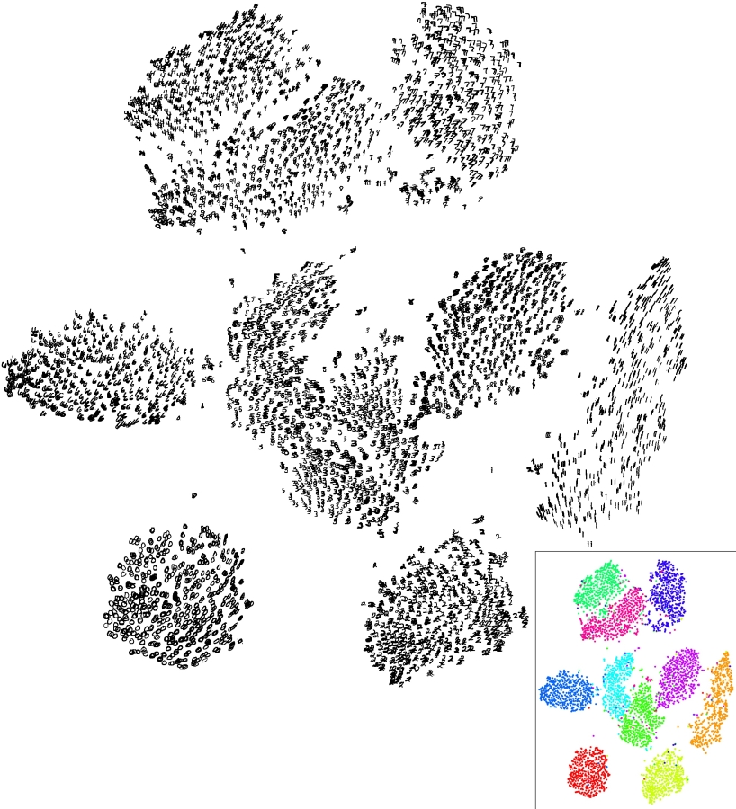

# MNIST for restricted Boltzmann machines

The MNIST database is a large set of handwritten digits used to train neural networks and other algorithms in image recognition. MNIST has 60,000 images in its training set and 10,000 in its test set.

MNIST derives from NIST, and stands for “Mixed National Institute of Standards and Technology.” The MNIST database reshuffles the NIST database's thousands of binary images of handwritten digits in order to better train and test various image recognition techniques. A full explanation of why MNIST is preferable to NIST can be found on [Yann LeCun's website](http://yann.lecun.com/exdb/mnist/).

Each image in the MNIST database is a 28x28 pixel cell, and each cell is contained within a bounding box, the four lines of pixels that frame it. The image is centered according to the center of mass of its pixels. Reconstructed with our restricted Boltzmann machines, the numbers look like this:

Here's an example of how neural nets can cluster random samplings of Mnist images:

MNIST is a good place to begin exploring image recognition. Here’s an easy way to load the data and get started.

# tutorial

To begin with, you’ll take an image from your data set and binarize it, which means you’ll convert its pixels from continuous gray scale to ones and zeros. A useful rule of thumb if that every gray-scale pixel with a value higher than 35 becomes a 1, and the rest are set to 0. The tool you’ll use to do that is an MNIST data-set iterator class.

The [MnistDataSetIterator](./doc/org/deeplearning4j/datasets/iterator/impl/MnistDataSetIterator.html) does this for you.

A DataSetIterator can be used like this:

         DataSetIterator iter = ....;

         while(iter.hasNext()) {
            DataSet next = iter.next();
            //do stuff with the data set
         }

When handling raw image import you will apply tools from datavec to normalize and binarize or scale the images. Our examples have an Mnist Image Pipeline example that demonstrates the normalization, labelling and pre-processing of directories of images. In the case of Mnist data it is so widely used that a special pre-built iterator, MnistDataSetIterator takes care of that for us.

         //Train on batches of 10 out of 60000
         DataSetIterator mnistData = new MnistDataSetIterator(10,60000);

We specify the batch size as well as the number of examples so the user can choose how many examples they want to look at.

Next, we want to train a restricted Boltzmann machine to reconstruct the MNIST data set. This is done with following snippet:

Now we'll show you how to train a deep-belief network [to reconstruct and recognize the MNIST images](./deepbeliefnetwork.html).
