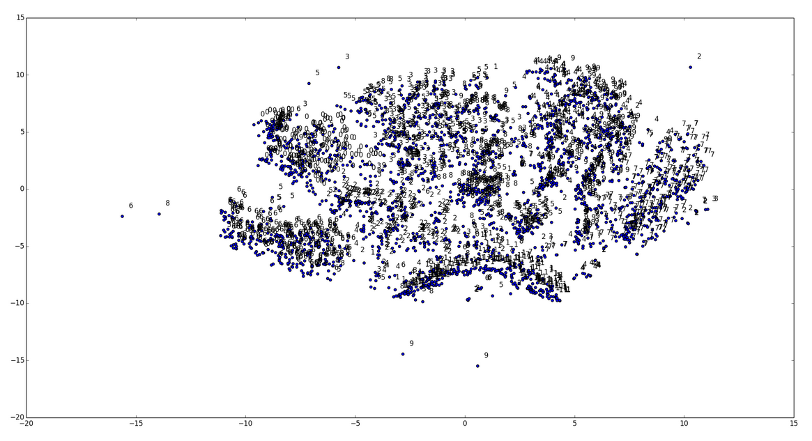
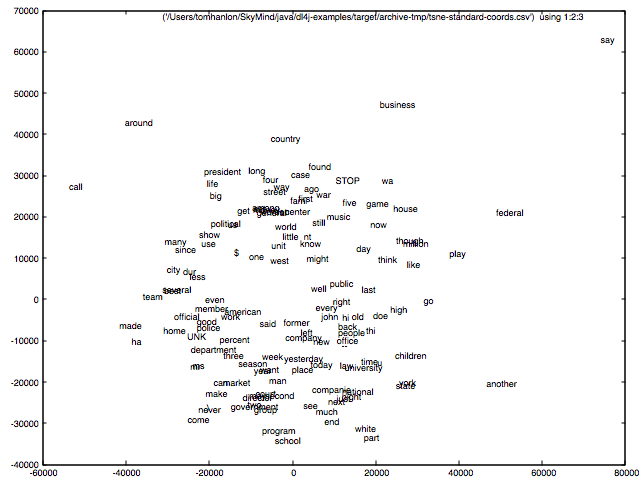

# t-SNE's Data Visualization

[t-Distributed Stochastic Neighbor Embedding](http://homepage.tudelft.nl/19j49/t-SNE.html) (t-SNE) is a data-visualization tool created by Laurens van der Maaten at Delft University of Technology.

While it can be used for any data, t-SNE (pronounced Tee-Snee) is only really meaningful with labeled data, which clarify how the input is clustering. Below, you can see the kind of graphic you can generate in DL4J with t-SNE working on [MNIST data](http://deeplearning4j.org/deepbeliefnetwork.html).

Look closely and you can see the numerals clustered near their likes, alongside the dots.

Here's how t-SNE appears in Deeplearning4j code.
<pre><code class="language-java">
public class TSNEStandardExample {

    private static Logger log = LoggerFactory.getLogger(TSNEStandardExample.class);

    public static void main(String[] args) throws Exception  {
        //STEP 1: Initialization
        int iterations = 100;
        //create an n-dimensional array of doubles
        DataTypeUtil.setDTypeForContext(DataBuffer.Type.DOUBLE);
        List<String> cacheList = new ArrayList<>(); //cacheList is a dynamic array of strings used to hold all words

        //STEP 2: Turn text input into a list of words
        log.info("Load & Vectorize data....");
        File wordFile = new ClassPathResource("words.txt").getFile();   //Open the file
        //Get the data of all unique word vectors
        Pair&lt;InMemoryLookupTable,VocabCache&gt; vectors = WordVectorSerializer.loadTxt(wordFile);
        VocabCache cache = vectors.getSecond();
        INDArray weights = vectors.getFirst().getSyn0();    //seperate weights of unique words into their own list

        for(int i = 0; i &lt; cache.numWords(); i++)   //seperate strings of words into their own list
            cacheList.add(cache.wordAtIndex(i));

        //STEP 3: build a dual-tree tsne to use later
        log.info("Build model....");
        BarnesHutTsne tsne = new BarnesHutTsne.Builder()
                .setMaxIter(iterations).theta(0.5)
                .normalize(false)
                .learningRate(500)
                .useAdaGrad(false)
//                .usePca(false)
                .build();

        //STEP 4: establish the tsne values and save them to a file
        log.info("Store TSNE Coordinates for Plotting....");
        String outputFile = "target/archive-tmp/tsne-standard-coords.csv";
        (new File(outputFile)).getParentFile().mkdirs();
        tsne.plot(weights,2,cacheList,outputFile);
        //This tsne will use the weights of the vectors as its matrix, have two dimensions, use the words strings as
        //labels, and be written to the outputFile created on the previous line

    }

}
</code></pre>

Here is an image of the tsne-standard-coords.csv file plotted using gnuplot.

<!-- was this??

-->
